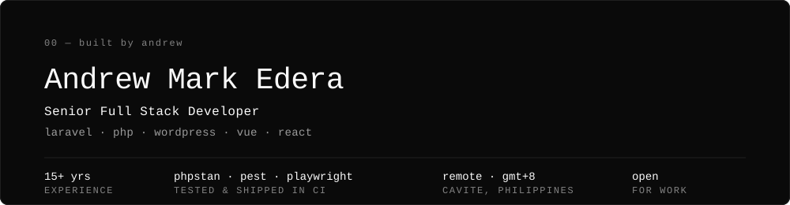

  

  

---

15 years building PHP systems for agencies and international clients. Laravel applications with Vue and React front ends, custom WordPress and WooCommerce platforms, and the integrations that tie them to the ERPs and business systems a company already runs on.

I work with static analysis, automated tests, and CI pipelines: PHPStan level 6, Pest, Playwright, and GitHub Actions running on every pull request. Most agency PHP work skips this. It is the main reason the things I ship stay maintainable.

---

## Featured work

Most of my client work sits behind NDAs, so these exist as a public reference for how I build today.

### [CommerceFlow](https://github.com/iamandrewedera/commerce-flow)
`Laravel 13` · `PHP 8.4` · `PostgreSQL 18` · `Sanctum` · `Pest` · `Larastan` · `GitHub Actions`

An eCommerce backend on a layered Controller / FormRequest / Action / Service structure. It stops overselling with atomic SQL constraints, saves a copy of the price at purchase time, and dispatches domain events after commit. Pint, Larastan level 6 and Pest run in CI on every push.

### WooCommerce ERP & Data Sync Suite
`WordPress` · `WooCommerce` · `Action Scheduler` · `ODBC`

Six production plugins that sync product, image and order data between WooCommerce and external ERP systems. Background processing via Action Scheduler and SKU-based matching, so they run unattended at scale. Includes EU VAT validation against VIES and B2B company verification at checkout.

---

## Tech

**Languages**

**Laravel**

**WordPress**

**Front end**

**Databases**

**Testing & code quality**

**CI/CD & infrastructure**

**Integrations**

**AI-assisted development**

I use Claude Code to scaffold features from specifications and structure I define myself. PHPStan, Pest and Playwright in CI check every generated line before it can merge.

---

## Currently

Deepening cloud infrastructure and scaling work: multi-region deployment, queue-driven architecture, and observability for PHP applications in production.

---

## Activity

